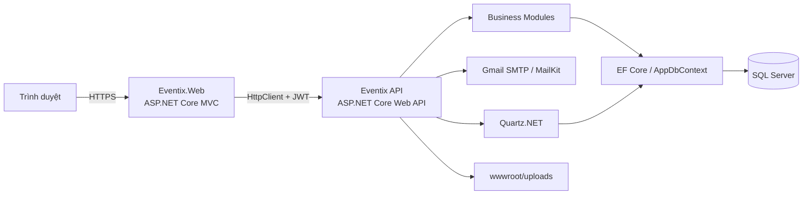
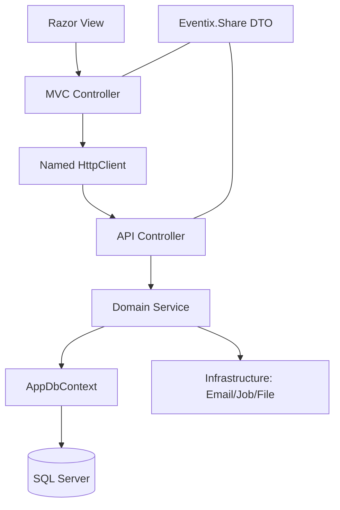

# 01. PHÂN TÍCH BÀI TOÁN VÀ KIẾN TRÚC EVENTIX

## 1. Mục đích tài liệu

Tài liệu này mô tả bài toán mà Eventix giải quyết, phạm vi nghiệp vụ, các yêu cầu
chính, kiến trúc phần mềm hiện tại và các quyết định kỹ thuật quan trọng. Nội dung
được đối chiếu với source code tại thời điểm 24/07/2026.

## 2. Bối cảnh bài toán

Eventix là nền tảng quản lý và bán vé sự kiện. Hệ thống kết nối ba nhóm chính:

- Khách hàng tìm kiếm sự kiện, giữ chỗ, thanh toán, nhận vé QR và check-in.
- Nhà tổ chức tạo địa điểm, sơ đồ khu/ghế, sự kiện và hạng vé.
- Quản trị viên kiểm soát tài khoản, hồ sơ nhà tổ chức và dữ liệu hệ thống.

Khó khăn cốt lõi không chỉ là tạo đơn hàng mà là duy trì tính nhất quán đồng thời
giữa số lượng vé, ghế cụ thể, lượt giữ 15 phút, thanh toán và vé điện tử. Hai người
không được mua cùng một ghế; lượt giữ hết hạn phải tự trả ghế; email không được làm
hỏng giao dịch chính nếu SMTP lỗi.

## 3. Mục tiêu hệ thống

1. Quản lý vòng đời người dùng và xác thực email bằng OTP.
2. Quản lý hồ sơ Organizer và quy trình phê duyệt.
3. Quản lý category, venue, section layout và seat map.
4. Tạo, chỉnh sửa, publish và tự động cập nhật trạng thái sự kiện.
5. Hỗ trợ hai mô hình vé dựa trên `TicketType.IsSeatRequired`:
   - Vé ngồi (`true`): seat map generate từ tên TicketType, buyer chọn ghế cụ thể.
   - Vé đứng (`false`): buyer chỉ nhập số lượng.
6. Giữ vé trong 15 phút với kiểm soát tranh chấp.
7. Tạo order, thanh toán, phát hành ticket và QR.
8. Hủy hoặc tự động hết hạn để hoàn lại tồn kho/ghế.
9. Check-in bằng QR và thống kê check-in.
10. Gửi email cho các mốc giữ vé, thanh toán, hủy và hết hạn.

## 4. Phạm vi và hiện trạng

### 4.1 Đã triển khai

| Nhóm | Chức năng |
|---|---|
| Auth | Đăng ký, OTP, đăng nhập, refresh token, logout, quên/đặt lại mật khẩu |
| User | Xem/sửa hồ sơ, avatar, đổi mật khẩu |
| Organizer | Đăng ký hồ sơ, duyệt/từ chối, xem sự kiện thuộc quyền |
| Catalog | Category, venue, venue zone, seat, ticket type |
| Event | Danh sách, chi tiết, tạo/sửa, upload ảnh, publish, Event Wizard |
| Booking | Chọn vé đứng/ngồi, chọn nhiều ghế, giữ 15 phút, xem/hủy lượt giữ |
| Commerce | Order, thanh toán Demo, phát hành ticket QR, danh sách vé |
| Check-in | Quét QR, khóa vé đã dùng, thống kê theo sự kiện |
| Automation | Job cập nhật trạng thái event và job giải phóng booking hết hạn |
| Email | OTP và thông báo toàn bộ vòng đời booking; QR nhúng trong mail thanh toán |

### 4.2 Chưa triển khai

- Payment gateway thật (VNPay, MoMo), webhook/callback và reconciliation.
- AI tagging và recommendation.

## 5. Yêu cầu nghiệp vụ trọng yếu

### 5.1 Tồn kho và ghế

- `AvailableQuantity = Quantity - SoldQuantity - ReservedQuantity`.
- Loại vé được xác định bởi `TicketType.IsSeatRequired`:
  - `true`: vé ngồi — buyer chọn ghế cụ thể trên seat map; seat map generate từ tên TicketType.
  - `false`: vé đứng — buyer chỉ nhập số lượng; không có seat map.
- Ghế được generate tự động khi Publish event, section = tên TicketType.
- Ghế phải thuộc đúng event và ticket type, trạng thái `Available`.
- Khi giữ: tăng `ReservedQuantity`, ghế `Available → Reserved`.
- Khi trả giữ: giảm `ReservedQuantity`, ghế `Reserved → Available`.
- Khi thanh toán: giảm reserved, tăng sold, ghế `Reserved → Sold`.

### 5.2 Đồng thời

Các thao tác giữ, hủy, hết hạn và thanh toán dùng transaction mức
`Serializable`. Database còn có unique index theo event/seat để giảm nguy cơ bán
trùng. Đây là phần có mức rủi ro cao nhất của hệ thống.

### 5.3 Thời hạn

- Reservation có `ExpiresAt = CreatedAt + 15 phút`.
- Order kế thừa hạn nhỏ nhất từ các reservation.
- `BookingExpirationJob` chạy mỗi phút nên việc giải phóng có thể trễ tối đa gần
  một phút so với mốc 15 phút.

### 5.4 Email

Email được gửi sau khi transaction đã commit. Lỗi SMTP được log nhưng không rollback
đặt/hủy/thanh toán. Email thanh toán chứa ảnh QR PNG inline theo Content-ID.

## 6. Kiến trúc tổng thể

Eventix dùng kiến trúc client MVC gọi REST API, kết hợp modular monolith ở backend.



## 7. Cấu trúc solution

### 7.1 `Eventix`

Backend API và nghiệp vụ chính:

```text
Eventix/
├── Modules/                 Controller, interface, service theo domain
├── Entities/                Entity EF Core
├── Data/AppDbContext.cs     Mapping, index, relationship
├── Infrastructure/
│   ├── Email/               SMTP, inline image
│   └── Jobs/                Quartz jobs
├── Common/                  Settings, exception, helper
└── Program.cs               DI, JWT, policy, Quartz, EF Core
```

Các module đang hoạt động: Auth, User, Organizer, Category, Event, Venue,
VenueZone, Seat, TicketType, Booking và Commerce.

### 7.2 `Eventix.Share`

Thư viện hợp đồng dùng chung:

- Request/response DTO.
- `ApiResponseModel<T>`, pagination.
- Constants và trạng thái.
- Validation attribute cơ bản.

API và Web cùng tham chiếu project này để giảm sai lệch contract.

### 7.3 `Eventix.Web`

ASP.NET Core MVC đóng vai trò UI/BFF đơn giản:

- Controller nhận form từ trình duyệt.
- JWT/refresh token được lưu trong cookie.
- Named `HttpClient("Eventix")` gọi API.
- Razor Views hiển thị event wizard, booking, checkout, ticket và QR.

## 8. Các lớp kiến trúc



### Trách nhiệm

| Lớp | Trách nhiệm |
|---|---|
| View | Hiển thị và thu thập input |
| Web Controller | Điều hướng, cookie, gọi API, chuyển ViewModel |
| API Controller | Endpoint, auth, lấy claim, chuẩn hóa response |
| Service | Validation nghiệp vụ, transaction, mapping |
| DbContext | Truy vấn, persistence, constraint mapping |
| Infrastructure | SMTP, Quartz, file storage, QR generation |

## 9. Pattern và quyết định thiết kế

- **Modular monolith:** tách module theo domain nhưng deploy cùng một API.
- **Dependency Injection:** interface/service đăng ký scoped trong `Program.cs`.
- **DTO boundary:** không trả trực tiếp EF entity ra client.
- **Transaction Script:** service điều phối transaction cho booking/commerce.
- **Background Job:** Quartz xử lý trạng thái theo thời gian.
- **Role/Policy authorization:** JWT Bearer và role claim.
- **Optimistic UI, authoritative server:** trạng thái ghế trên UI chỉ tham khảo;
  server kiểm tra lại trong transaction.

## 10. Bảo mật

- Mật khẩu hash bằng BCrypt.
- JWT kiểm tra signing key, issuer, audience, lifetime; `ClockSkew = 0`.
- Refresh token được lưu trong database.
- API trả 401/403 theo mẫu `ApiResponseModel`.
- Endpoint organizer yêu cầu role phù hợp; các thao tác event/ticket cần kiểm tra
  quyền sở hữu trong service.
- Input dùng DataAnnotations và validation nghiệp vụ.

### Rủi ro cần xử lý trước production

1. Không lưu JWT key, mật khẩu SQL hoặc SMTP app password trong source/appsettings.
2. Chuyển secret sang environment variable, Secret Manager hoặc vault.
3. Bật `RequireHttpsMetadata` ngoài Development.
4. Bổ sung rate limit cho login, OTP, resend và check-in.
5. Bổ sung CSRF review cho các form MVC thay đổi dữ liệu.
6. Thay payment Demo bằng gateway thật và xác minh webhook/idempotency.

## 11. Khả năng mở rộng

### Hiện tại

Một API instance và một SQL Server phù hợp đồ án/demo. Quartz chạy trong process API.
File upload nằm trên local disk.

### Khi triển khai nhiều instance

- Dùng distributed lock hoặc Quartz persistent store để tránh chạy job trùng.
- Chuyển upload sang object storage.
- Dùng outbox/message queue cho email để retry mà không giữ request.
- Cache danh sách sự kiện và category.
- Thêm idempotency key cho payment/check-in.
- Tách reporting/read model nếu tải truy vấn tăng cao.

## 12. Chất lượng và kiểm thử đề xuất

| Mức | Trường hợp quan trọng |
|---|---|
| Unit | Tính tồn kho, state transition, thời hạn, tổng tiền |
| Integration | Hai request giữ cùng ghế; rollback transaction; unique index |
| API | 401/403, validation, pagination, ownership |
| E2E | Đăng ký → đặt → thanh toán → nhận QR → check-in |
| Job | Hết hạn đúng nhóm order, trả ghế và gửi một email |
| Email | QR inline mở được trên Gmail/Outlook, nhiều vé trong một mail |

## 13. Kết luận kiến trúc

Kiến trúc hiện tại phù hợp một modular monolith cho đồ án: dễ phát triển, debug và
deploy nhưng vẫn có ranh giới module rõ. Trọng tâm kỹ thuật của Eventix là đảm bảo
nhất quán booking/seat bằng transaction và constraint database. Các bước ưu tiên tiếp
theo là payment thật, quản lý secret, test đồng thời và cơ chế email bất đồng bộ.