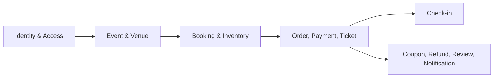
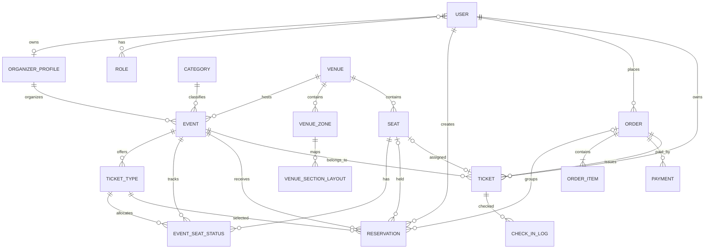

# 02. PHÂN TÍCH DATABASE EVENTIX

## 1. Tổng quan

Eventix sử dụng SQL Server và Entity Framework Core 8 thông qua `AppDbContext`.
Mô hình hiện có 31 entity/DbSet, bao phủ tài khoản, tổ chức sự kiện, địa điểm,
booking, commerce, check-in và các chức năng dự kiến.



## 2. Quy ước dữ liệu

- Khóa chính phần lớn là `Guid Id`.
- Thời gian được lưu bằng `DateTime`; nghiệp vụ tạo dữ liệu dùng UTC.
- Trạng thái lưu dạng string để dễ đọc nhưng phải dùng hằng số hệ thống.
- Tiền dùng `decimal`; đơn vị hiện tại là VND.
- Quan hệ được cấu hình bằng Fluent API trong `AppDbContext`.
- Nhiều quan hệ dùng `DeleteBehavior.ClientSetNull`, hạn chế cascade delete ngoài ý muốn.

## 3. Các nhóm bảng

### 3.1 Identity và phân quyền

| Bảng | Mục đích | Quan hệ/constraint chính |
|---|---|---|
| `Users` | Tài khoản, email, password hash, profile, trạng thái | Email unique; N-N với Role |
| `Roles` | Admin/User/Customer/Organizer | Name unique |
| `UserRoles` | Bảng nối do EF tạo | PK ghép UserId + RoleId |
| `UserRefreshTokens` | Refresh token và thời hạn | Index Token, UserId; N-1 User |
| `EmailOtps` | OTP đăng ký/reset password | Index Email + Purpose; N-1 User |
| `AuditLogs` | Nhật ký tác động entity | Index EntityType + EntityId; N-1 User |

`Users.EmailVerified` phân biệt tài khoản đã xác thực. `Status` có các giá trị
`ACTIVE`, `INACTIVE`, `BANNED`, `DELETED`.

### 3.2 Organizer và danh mục sự kiện

| Bảng | Mục đích | Quan hệ/constraint chính |
|---|---|---|
| `OrganizerProfiles` | Hồ sơ xin quyền tổ chức | UserId unique; 1-1 User |
| `Categories` | Phân loại sự kiện | Slug unique |
| `Events` | Thông tin sự kiện và vòng đời | Slug unique; FK Category, Venue, Organizer |
| `EventImages` | Bộ ảnh sự kiện | Thuộc Event |
| `EventAitags` | Nhãn AI dự kiến | Entity đã có, chưa có service AI |
| `UserEventInteractions` | Hành vi người dùng dự kiến cho gợi ý | N-1 User; chưa có recommendation flow |

Index đáng chú ý của `Events`:

- `CategoryId`.
- `VenueId`.
- `(Status, StartTime)` phục vụ lọc sự kiện sắp diễn ra.
- `ViewCount`.
- `Slug` unique.

Vòng đời Event:

```text
Draft → Published → OnSale → SoldOut
                    ↓
                 Ongoing → Completed
Bất kỳ trạng thái phù hợp → Cancelled
```

### 3.3 Venue, zone và sơ đồ ghế

| Bảng | Mục đích | Quan hệ/constraint chính |
|---|---|---|
| `Venues` | Địa điểm tổ chức | N-1 User tạo venue |
| `VenueZones` | Khu vực vé trong venue | `(VenueId, Name)` unique |
| `VenueSectionLayouts` | Layout/section và liên kết zone | `(VenueId, Section)` unique |
| `Seats` | Ghế vật lý, hàng, số, tọa độ | `(VenueId, Section, Row, Number)` unique |

`VenueZone.HasSeats` quyết định mô hình bán vé:

- `false`: khu đứng, người dùng chọn số lượng.
- `true`: khu ngồi, người dùng chọn các `SeatId` cụ thể.

`Seat.XPosition/YPosition` phục vụ dựng seat map. Section/Row/Number là định danh
nghiệp vụ; unique index ngăn tạo hai ghế trùng trong cùng venue.

### 3.4 Inventory và booking

| Bảng | Mục đích | Quan hệ/constraint chính |
|---|---|---|
| `TicketTypes` | Hạng vé, giá, quota, thời gian bán | FK Event; index EventId và EventId+Section |
| `EventSeatStatuses` | Trạng thái từng ghế theo event/ticket type | `(EventId, SeatId)` unique |
| `Reservations` | Lượt giữ vé tạm thời | Index `(ExpiresAt, Status)`; liên kết User/Order |

Các cột tồn kho quan trọng của TicketType:

- `Quantity`: tổng quota.
- `ReservedQuantity`: số đang được giữ.
- `SoldQuantity`: số đã bán.
- `IsSeatRequired`: có bắt buộc chọn ghế hay không.
- `SaleStartTime`, `SaleEndTime`, `Status`.

Bất biến cần duy trì:

```text
0 <= ReservedQuantity
0 <= SoldQuantity
ReservedQuantity + SoldQuantity <= Quantity
AvailableQuantity = Quantity - ReservedQuantity - SoldQuantity
```

`EventSeatStatus` tách trạng thái ghế của một sự kiện khỏi `Seat` vật lý. Cùng một
venue có thể tái sử dụng seat map cho nhiều event, trong khi trạng thái Available,
Reserved, Sold là riêng từng event.

`Reservations` có:

- `UserId`, `EventId`, `TicketTypeId`, `SeatId?`, `OrderId?`.
- `Quantity`, `Status`, `CreatedAt`, `ExpiresAt`.
- Vé ngồi tạo một reservation cho mỗi ghế; vé đứng có thể dùng một reservation với
  quantity lớn hơn 1.

State machine:

```text
Active → Confirmed
Active → Cancelled
Active → Expired
```

Index `(ExpiresAt, Status)` giúp job tìm reservation Active quá hạn. Index lọc
`UX_Reservations_ActiveSeat` là lớp bảo vệ database chống nhiều lượt giữ đang hoạt
động trên cùng event/seat.

### 3.5 Order, payment và ticket

| Bảng | Mục đích | Quan hệ/constraint chính |
|---|---|---|
| `Orders` | Đơn hàng tổng | OrderCode unique; index UserId, Status |
| `OrderItems` | Snapshot hạng vé/ghế/giá tại lúc tạo đơn | N-1 Order |
| `Payments` | Giao dịch thanh toán | Index OrderId; FK User và Order |
| `PaymentWebhookLogs` | Chống xử lý webhook trùng trong tương lai | `(Gateway, EventId)` unique |
| `Tickets` | Vé điện tử đã phát hành | TicketCode và QrToken unique |

Order lưu `SubTotal`, `ServiceFee`, `DiscountAmount`, `TotalAmount`, `ExpiresAt`,
`PaidAt`. `OrderItem` là snapshot nên thay đổi giá TicketType sau này không làm sai
lịch sử đơn hàng.

State machine:

```text
Order:   Pending → Paid / Cancelled / Expired
Payment: Pending → Success / Failed
Ticket:  Active → Used / Cancelled
```

Constraint quan trọng của Ticket:

- `TicketCode` unique.
- `QrToken` unique.
- Index `EventId`, `UserId`.
- Unique event/seat đối với vé có ghế, ngăn phát hành hai ticket cho cùng chỗ.

### 3.6 Check-in

| Bảng | Mục đích | Quan hệ/constraint chính |
|---|---|---|
| `CheckInLogs` | Nhật ký mỗi lần check-in thành công | FK Ticket, Event và CheckedInBy |

Khi QR hợp lệ, Ticket chuyển `Active → Used` và tạo CheckInLog. Ticket không còn
Active bị từ chối, nhờ đó một QR không thể check-in thành công hai lần.

### 3.7 Chức năng hỗ trợ/scaffold

| Bảng | Mục đích dự kiến | Hiện trạng |
|---|---|---|
| `Carts`, `CartItems` | Giỏ hàng | Chưa có luồng hoàn chỉnh |
| `Coupons`, `CouponUsages` | Mã giảm giá và lịch sử dùng | Chưa tích hợp checkout |
| `RefundPolicies`, `RefundRequests` | Chính sách/yêu cầu hoàn tiền | Chưa có service hoàn chỉnh |
| `Reviews` | Đánh giá sự kiện | Unique EventId+UserId; chưa có API hoàn chỉnh |
| `Notifications` | Thông báo trong ứng dụng | Có entity, chưa có module hoàn chỉnh |

## 4. ERD rút gọn cho luồng cốt lõi



## 5. Phân tích transaction và consistency

### 5.1 Giữ vé

Trong transaction `Serializable`:

1. Đọc TicketType và quota.
2. Đọc ghế Available đúng event/ticket type.
3. Tạo Reservation.
4. Tăng ReservedQuantity.
5. Chuyển EventSeatStatus sang Reserved.
6. Commit.

Nếu bất kỳ kiểm tra nào thất bại, toàn bộ thay đổi rollback.

### 5.2 Thanh toán

1. Khóa logic Order Pending còn hạn.
2. Xác minh toàn bộ Reservation Active.
3. Giảm reserved, tăng sold.
4. Reservation → Confirmed; seat → Sold.
5. Tạo Ticket và Payment Success; Order → Paid.
6. Commit rồi mới gửi email QR.

### 5.3 Hủy/hết hạn

Cả hủy thủ công và job hết hạn phải cập nhật đồng bộ Reservation, Order,
TicketType.ReservedQuantity và EventSeatStatus. Email được gửi sau commit.

## 6. Index và mục đích

| Index | Mục đích |
|---|---|
| Users.Email unique | Không trùng tài khoản |
| Events.Slug unique | URL ổn định |
| Events(Status, StartTime) | Danh sách theo trạng thái/thời gian |
| Seats(Venue, Section, Row, Number) unique | Không trùng ghế vật lý |
| EventSeatStatuses(Event, Seat) unique | Một trạng thái/ghế/event |
| Reservations(ExpiresAt, Status) | Job expiration |
| Orders.OrderCode unique | Tra cứu đơn |
| Tickets.TicketCode/QrToken unique | Chống trùng vé/QR |
| Reviews(Event, User) unique | Một đánh giá/người/sự kiện |
| Coupons.Code unique | Mã giảm giá duy nhất |

## 7. Điểm mạnh

- Mô hình tách venue seat và event seat status hợp lý cho địa điểm tái sử dụng.
- OrderItem lưu snapshot giá.
- State rõ ràng cho reservation/order/payment/ticket/seat.
- Constraint và transaction cùng bảo vệ chống oversell.
- Index phục vụ đúng các truy vấn thời gian và tra cứu QR.

## 8. Rủi ro và đề xuất

1. **String status:** có nguy cơ typo; nên thêm check constraint hoặc value converter enum.
2. **Counter denormalization:** ReservedQuantity/SoldQuantity có thể lệch; cần job audit hoặc
   câu lệnh đối soát định kỳ.
3. **DateTime:** nên chuẩn hóa UTC và cân nhắc `datetimeoffset`.
4. **Soft delete:** cần quy ước rõ cho User/Event/Venue thay vì xóa vật lý.
5. **Migration:** quản lý schema bằng EF Migration có version và seed tách môi trường.
6. **Payment idempotency:** thêm unique gateway transaction/idempotency key.
7. **Outbox:** email hiện gửi sau commit nhưng chưa retry bền vững; nên dùng OutboxMessage.
8. **PII và secret:** mã hóa/bảo vệ dữ liệu nhạy cảm, không commit credentials.
9. **Concurrency test:** bắt buộc test hai transaction cùng giữ/thanh toán một ghế.
10. **Foreign key đầy đủ:** rà soát các entity scaffold như EventAitag/EventImage để bảo đảm
    navigation và delete rule thống nhất trước khi triển khai module.

## 9. Truy vấn kiểm tra tính toàn vẹn đề xuất

```sql
-- TicketType có counter vượt quota
SELECT Id, Quantity, ReservedQuantity, SoldQuantity
FROM TicketTypes
WHERE ReservedQuantity < 0
   OR SoldQuantity < 0
   OR ReservedQuantity + SoldQuantity > Quantity;

-- Ghế Reserved nhưng không còn reservation Active
SELECT ess.EventId, ess.SeatId
FROM EventSeatStatuses ess
WHERE ess.Status = 'Reserved'
  AND NOT EXISTS (
      SELECT 1 FROM Reservations r
      WHERE r.EventId = ess.EventId
        AND r.SeatId = ess.SeatId
        AND r.Status = 'Active'
  );

-- Ticket ghế không đồng bộ trạng thái Sold
SELECT t.Id, t.EventId, t.SeatId
FROM Tickets t
JOIN EventSeatStatuses ess
  ON ess.EventId = t.EventId AND ess.SeatId = t.SeatId
WHERE t.Status <> 'Cancelled' AND ess.Status <> 'Sold';
```

## 10. Kết luận

Database hỗ trợ tốt luồng cốt lõi của hệ thống bán vé, đặc biệt ở việc tách ghế vật
lý, trạng thái ghế theo sự kiện và lượt giữ tạm thời. Các ưu tiên tiếp theo là test
đồng thời, đối soát counter, chuẩn hóa migration/UTC và bổ sung idempotency/outbox
trước khi dùng payment thật.