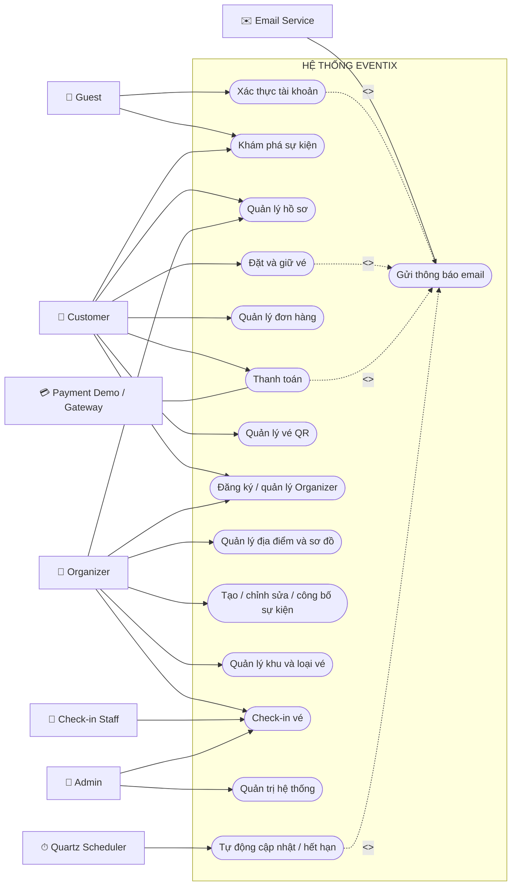
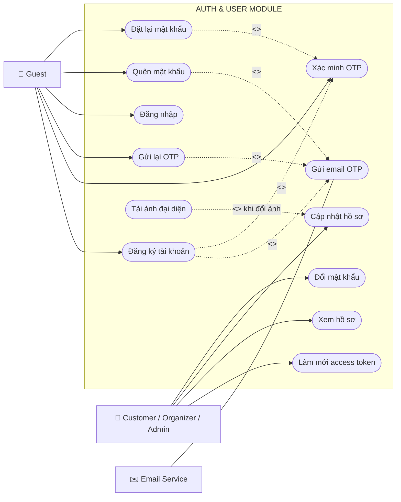
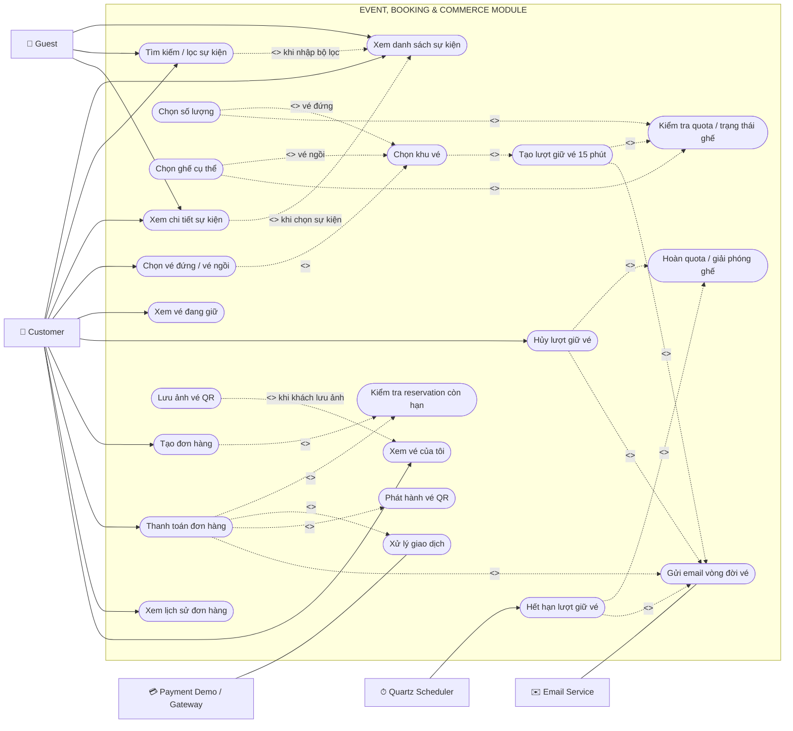
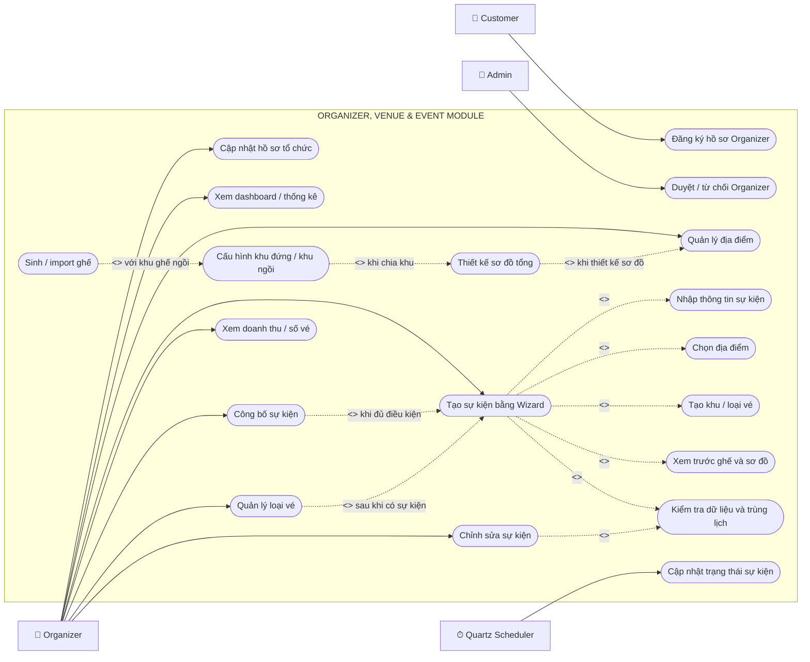
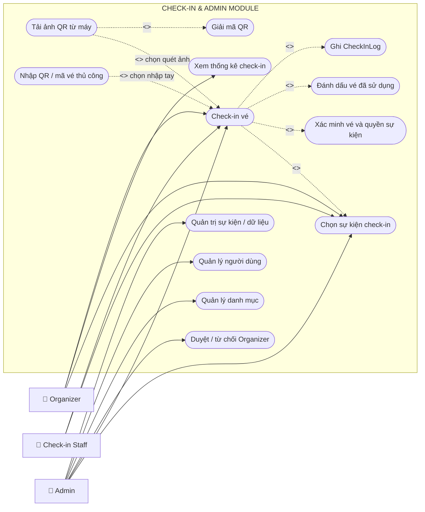
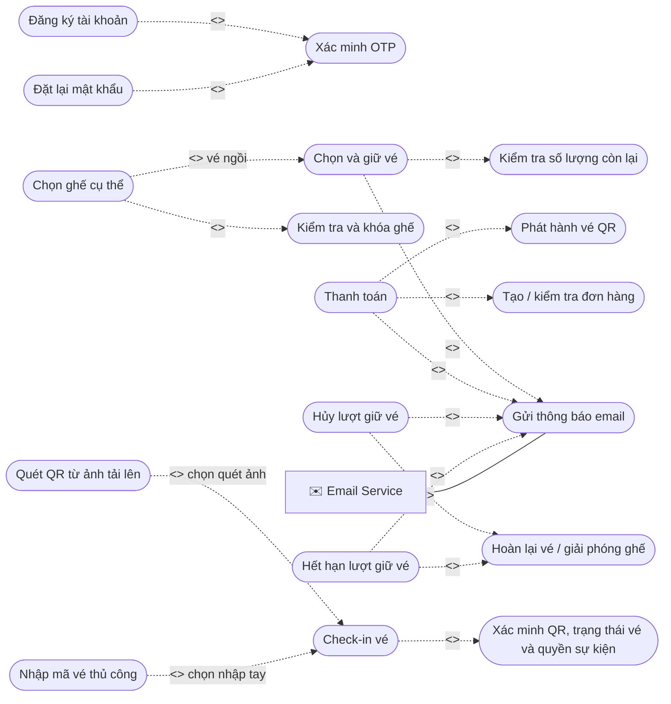

# 03. ACTOR VÀ USE CASE EVENTIX

## 1. Mục đích

Tài liệu xác định tác nhân tương tác với Eventix, quyền hạn, use case chính, điều kiện
trước/sau và quan hệ giữa các use case. Phạm vi phản ánh source code hiện tại.

## 2. Danh sách actor

### 2.1 Actor con người

| Actor | Mô tả | Cách xác thực |
|---|---|---|
| Guest | Người chưa đăng nhập | Không có JWT |
| Customer/User | Người dùng đã có tài khoản | JWT, role User/Customer tùy seed |
| Organizer | Người tổ chức đã được cấp role/quyền | JWT + role Organizer + ownership |
| Admin | Quản trị hệ thống | JWT + role Admin |
| Check-in Staff | Người quét vé cho sự kiện | Hiện dùng tài khoản Organizer/Admin |

`User` và `Customer` cùng tồn tại trong constants. Trong tài liệu này, “Customer”
đại diện người dùng mua vé; khi triển khai cần thống nhất một role chính để tránh
policy không đồng nhất.

### 2.2 Actor hệ thống/ngoại vi

| Actor | Vai trò |
|---|---|
| Eventix.Web | MVC client gọi REST API thay mặt trình duyệt |
| Gmail SMTP | Gửi OTP và email vòng đời đặt vé |
| Quartz Scheduler | Kích hoạt EventStatusJob và BookingExpirationJob mỗi phút |
| SQL Server | Lưu trạng thái giao dịch và áp constraint |
| Payment Demo | Mô phỏng cổng thanh toán thành công |
| File System | Lưu avatar/banner/image trong `wwwroot/uploads` |

## 3. Use Case Diagram toàn bộ dự án

### 3.1 Phạm vi hệ thống và actor

Các actor trực tiếp của Eventix gồm:

- **Guest:** xem sự kiện, đăng ký, đăng nhập và đặt lại mật khẩu.
- **Customer:** đặt vé, thanh toán, quản lý lượt giữ, đơn hàng và vé QR.
- **Organizer:** quản lý hồ sơ tổ chức, địa điểm, sự kiện, khu vé, sơ đồ và check-in.
- **Check-in Staff:** thực hiện check-in dưới quyền của Organizer/Admin.
- **Admin:** duyệt Organizer và quản trị dữ liệu nền.
- **Email Service / Gmail SMTP:** hệ thống ngoài nhận yêu cầu gửi OTP và thông báo vòng đời vé.
- **Quartz Scheduler:** hệ thống ngoài kích hoạt hết hạn giữ vé và cập nhật trạng thái sự kiện.
- **Payment Demo / Payment Gateway:** xử lý yêu cầu thanh toán của Eventix.

SQL Server và File System là hạ tầng nội bộ, không phải actor nghiệp vụ trong Use Case Diagram.

### 3.2 Sơ đồ tổng quan toàn hệ thống

### 3.3 Xác thực và hồ sơ người dùng

### 3.4 Khám phá, đặt vé, thanh toán và vé QR

### 3.5 Organizer, địa điểm và quản lý sự kiện

### 3.6 Check-in và quản trị

### 3.7 Quy ước chiều mũi tên

- `A --<<include>>--> B`: A luôn gọi B như một bước bắt buộc hoặc dùng chung.
- `X --<<extend>>--> A`: X bổ sung cho A khi có điều kiện hoặc lựa chọn cụ thể.
- Actor nối bằng đường liền với use case mà actor trực tiếp khởi tạo hoặc tham gia.
- Actor ngoài hệ thống như Email, Scheduler và Payment Gateway đặt ngoài biên `Eventix`.

## 4. Ma trận quyền use case

Ký hiệu: `✓` được thực hiện, `R` chỉ đọc/public, `Own` chỉ dữ liệu thuộc quyền,
`—` không được phép.

| Use case | Guest | Customer | Organizer | Admin |
|---|:---:|:---:|:---:|:---:|
| Xem danh sách/chi tiết event | R | R | R | R |
| Đăng ký, OTP, login, reset password | ✓ | ✓ | ✓ | ✓ |
| Quản lý hồ sơ cá nhân | — | Own | Own | Own |
| Đăng ký hồ sơ Organizer | — | ✓ | — | — |
| Tạo/sửa venue | — | — | Own | Quản trị |
| Tạo/sửa/publish event | — | — | Own | Quản trị |
| Quản lý zone/seat/ticket type | — | — | Own | Quản trị |
| Giữ vé/chọn ghế | — | ✓ | ✓* | ✓* |
| Tạo order/thanh toán | — | Own | Own* | Own* |
| Xem/hủy booking của mình | — | Own | Own | Own |
| Xem vé của mình | — | Own | Own | Own |
| Quét QR sự kiện | — | — | Own event | ✓ |
| Duyệt/từ chối Organizer | — | — | — | ✓ |

`*` Organizer/Admin vẫn có thể là người mua nếu API chỉ yêu cầu authenticated user;
vai trò mua vé nên được thống nhất bằng policy nếu nghiệp vụ muốn giới hạn.

## 5. Đặc tả use case Guest/Auth

### UC-A01: Xem và tìm kiếm sự kiện

- **Actor:** Guest, mọi tài khoản.
- **Tiền điều kiện:** Không.
- **Luồng chính:** Nhập từ khóa/bộ lọc → API lấy event public → hiển thị danh sách →
  mở chi tiết.
- **Hậu điều kiện:** Không thay đổi dữ liệu nghiệp vụ; view count có thể được cập nhật.
- **Ngoại lệ:** Event không tồn tại hoặc không public.

### UC-A02: Đăng ký tài khoản

- **Actor:** Guest.
- **Tiền điều kiện:** Email chưa tồn tại.
- **Luồng chính:** Nhập thông tin → hash password → tạo user/OTP → gửi email → nhập
  OTP → xác thực email.
- **Hậu điều kiện:** User được kích hoạt/xác thực và có role mặc định.
- **Ngoại lệ:** Email trùng, OTP sai/hết hạn, SMTP lỗi.

### UC-A03: Đăng nhập

- **Actor:** Guest.
- **Tiền điều kiện:** Tài khoản tồn tại, hợp lệ, đã xác thực theo rule AuthService.
- **Luồng chính:** Kiểm tra password → tạo access/refresh token → Web lưu cookie.
- **Hậu điều kiện:** Request sau mang JWT.
- **Ngoại lệ:** Sai thông tin, tài khoản bị khóa, token hết hạn.

### UC-A04: Quên/đặt lại mật khẩu

- **Actor:** Guest/User.
- **Luồng:** Yêu cầu OTP → email OTP → xác minh → đặt password mới.
- **Bảo mật:** OTP có purpose riêng và thời hạn.

## 6. Đặc tả use case Customer

### UC-C01: Quản lý hồ sơ

- Xem/cập nhật FullName, PhoneNumber và thông tin cá nhân.
- Upload avatar vào vùng file cho phép.
- Đổi mật khẩu sau khi xác minh mật khẩu hiện tại.

### UC-C02: Chọn và giữ vé đứng

- **Tiền điều kiện:** Đã đăng nhập; event/ticket type đang bán; quota đủ.
- **Luồng:** Chọn loại “Vé đứng” → chọn zone → chọn hạng vé → nhập quantity → gửi
  booking → server tạo reservation Active 15 phút.
- **Hậu điều kiện:** ReservedQuantity tăng; email giữ vé được gửi.

### UC-C03: Chọn và giữ vé ngồi

- **Tiền điều kiện:** Như UC-C02; zone `HasSeats = true`.
- **Luồng:** Chọn loại “Vé ngồi” → zone → ticket type → xem seat map → chọn tối đa
  số ghế cho phép → server kiểm tra lại trạng thái → giữ từng ghế.
- **Hậu điều kiện:** EventSeatStatus `Available → Reserved`; một reservation/ghế.
- **Ngoại lệ:** Ghế vừa bị người khác giữ; trả Conflict và tải lại sơ đồ.

### UC-C04: Xem và hủy lượt giữ

- **Tiền điều kiện:** Reservation thuộc user và còn Active.
- **Luồng:** Mở “Vé đang giữ” → chọn hủy → trả quota/ghế → hủy order Pending liên quan.
- **Hậu điều kiện:** Reservation Cancelled; email hủy được gửi.

### UC-C05: Tạo đơn hàng

- Chọn một hoặc nhiều reservation Active còn hạn.
- Hệ thống tạo Order Pending, OrderItem snapshot và gắn Reservation.OrderId.
- Tổng tiền gồm subtotal và service fee hiện tại.

### UC-C06: Thanh toán và nhận vé QR

- **Tiền điều kiện:** Order Pending, chưa hết hạn; toàn bộ reservation Active.
- **Luồng:** Xác nhận thanh toán Demo → cập nhật inventory → phát hành Ticket → tạo
  Payment Success → gửi email có QR.
- **Hậu điều kiện:** Order Paid, Reservation Confirmed, Seat Sold, Ticket Active.
- **Ngoại lệ:** Order hết hạn/đã xử lý, reservation không còn Active.

### UC-C07: Xem vé của tôi

- Xem danh sách ticket đã phát hành.
- Mở chi tiết ticket để hiển thị QR từ QrToken.
- TicketCode và QR là định danh duy nhất.

### UC-C08: Booking tự hết hạn

- **Actor khởi tạo:** Quartz, không phải Customer.
- Reservation quá 15 phút chưa thanh toán → Expired → trả quota/ghế → email đặt vé
  thất bại.

## 7. Đặc tả use case Organizer

### UC-O01: Đăng ký hồ sơ Organizer

- **Actor:** Customer.
- **Luồng:** Gửi thông tin doanh nghiệp/cá nhân → OrganizerProfile Pending → chờ Admin.
- **Hậu điều kiện:** Chỉ profile Approved mới nên được phép vận hành event.

### UC-O02: Quản lý venue

- Tạo/sửa venue thuộc quyền.
- Khai báo capacity và thông tin địa điểm.
- Xem/cập nhật seat map.

### UC-O03: Quản lý zone và section layout

- Tạo zone đứng/ngồi.
- Ánh xạ section với zone.
- Kiểm tra capacity và trạng thái import ghế.

### UC-O04: Quản lý ghế

- Xem ghế theo venue/section.
- Download template/import Excel.
- Generate ghế theo hàng, số, tọa độ.
- Đảm bảo không trùng `(Venue, Section, Row, Number)`.

### UC-O05: Tạo sự kiện bằng Event Wizard

Các bước thực tế gồm thông tin cơ bản, venue, zone/seat, ticket type, ảnh và xác nhận.
Wizard lưu trạng thái tạm qua web/session/form và gọi API ở các bước tương ứng.

### UC-O06: Publish sự kiện

- **Tiền điều kiện:** Event thuộc organizer, dữ liệu bắt buộc hợp lệ, có ticket type.
- **Luồng:** Validate → đổi Draft sang Published/OnSale theo nghiệp vụ.
- **Hậu điều kiện:** Event xuất hiện với khách hàng khi đủ điều kiện public.

### UC-O07: Quản lý ticket type

- Tạo/sửa/deactivate hạng vé.
- Khai báo giá, quota, sale window, zone/section, yêu cầu ghế.
- Không được làm quota nhỏ hơn số đã bán/đang giữ.

### UC-O08: Check-in và xem thống kê

- Chọn event thuộc quyền.
- Quét/nhập QrToken.
- Ticket Active → Used và tạo CheckInLog.
- Xem tổng vé, đã check-in và còn lại.

## 8. Đặc tả use case Admin

### UC-AD01: Duyệt Organizer

- Xem hồ sơ Pending.
- Approve hoặc Reject.
- Khi approve, hệ thống cần bảo đảm role Organizer được gán nhất quán.

### UC-AD02: Quản trị dữ liệu nền

- Quản lý category, user, venue/event khi có endpoint tương ứng.
- Can thiệp trạng thái sai phạm theo policy.
- Phần admin tập trung hiện chưa đầy đủ, cần xem là phạm vi mở rộng.

### UC-AD03: Check-in hỗ trợ

Admin có thể check-in cho mọi event theo logic `isAdmin`; Organizer chỉ event thuộc quyền.

## 9. Quan hệ `<<include>>` và `<<extend>>`

### 9.1 Sơ đồ quan hệ chi tiết

### 9.2 Giải thích `<<include>>`

`A <<include>> B` nghĩa là **mỗi lần thực hiện A thì B là bước bắt buộc hoặc được tái sử dụng**.
Mũi tên nét đứt đi từ `A` sang `B`.

| Use case chính A | Use case được include B | Lý do |
|---|---|---|
| Đăng ký tài khoản | Xác minh OTP | Tài khoản phải xác minh email theo luồng đăng ký hiện tại |
| Chọn và giữ vé | Kiểm tra số lượng còn lại | Không được giữ vượt quá quota |
| Chọn ghế cụ thể | Kiểm tra và khóa ghế | Ghế phải còn trống và được khóa nguyên tử |
| Thanh toán | Tạo/kiểm tra đơn hàng | Chỉ thanh toán đơn hợp lệ, chưa hết hạn |
| Thanh toán | Phát hành vé QR | Thanh toán thành công phải tạo vé sử dụng để check-in |
| Check-in | Xác minh QR, trạng thái và quyền | Mọi hình thức check-in đều phải xác minh vé |
| Giữ/thanh toán/hủy/hết hạn | Gửi thông báo email | Đây là hậu xử lý bắt buộc theo yêu cầu hiện tại |

Ví dụ: `Thanh toán --<<include>>--> Phát hành vé QR` vì một giao dịch được xem là hoàn tất trong
Eventix khi hệ thống cập nhật đơn hàng và phát hành vé tương ứng.

### 9.3 Giải thích `<<extend>>`

`X <<extend>> A` nghĩa là **X chỉ bổ sung cho A tại một extension point và chỉ chạy khi thỏa điều kiện**.
Mũi tên nét đứt đi từ use case mở rộng `X` về use case gốc `A`.

| Use case mở rộng X | Use case gốc A | Điều kiện mở rộng |
|---|---|---|
| Chọn ghế cụ thể | Chọn và giữ vé | Chỉ khi loại vé là vé ngồi; vé đứng chỉ chọn khu và số lượng |
| Quét QR từ ảnh tải lên | Check-in vé | Nhân viên chọn phương thức tải ảnh |
| Nhập mã vé thủ công | Check-in vé | Nhân viên chọn phương thức nhập tay |
| Công bố sự kiện | Tạo/chỉnh sửa sự kiện | Organizer chọn công bố ngay hoặc khi sự kiện đủ điều kiện |

Ví dụ: `Chọn ghế cụ thể --<<extend>>--> Chọn và giữ vé`. Việc giữ vé luôn tồn tại, nhưng bước chọn
số ghế chỉ xuất hiện với khu vé ngồi, vì vậy đây là `extend`, không phải `include` của mọi booking.

### 9.4 Phân biệt nhanh

| Tiêu chí | `<<include>>` | `<<extend>>` |
|---|---|---|
| Có bắt buộc không? | Có, trong phạm vi use case chính | Không, chỉ xảy ra theo điều kiện/lựa chọn |
| Mục đích | Tách bước dùng chung hoặc bắt buộc | Bổ sung một biến thể cho luồng gốc |
| Hướng mũi tên | Use case chính → use case được include | Use case mở rộng → use case gốc |
| Ví dụ Eventix | Check-in → Xác minh vé | Quét ảnh QR → Check-in |

## 10. Quy tắc authorization cần duy trì

1. Luôn lấy UserId từ JWT claim, không nhận UserId tùy ý từ client.
2. Booking/order/ticket chỉ truy cập dữ liệu có UserId trùng claim.
3. Organizer phải được kiểm tra ownership của event/venue.
4. Admin bypass ownership chỉ ở use case được định nghĩa rõ.
5. API public chỉ gồm danh sách/chi tiết event, category và dữ liệu thực sự công khai.
6. Phân biệt 401 (chưa xác thực/token lỗi) và 403 (đã xác thực nhưng thiếu quyền).

## 11. Use case chưa hoàn thiện

Các use case sau chưa có implementation:

- AI tagging và gợi ý sự kiện.
- Payment gateway thật (VNPay, MoMo) và webhook.

## 12. Kịch bản demo đề xuất

1. Guest đăng ký và nhập OTP.
2. Customer mở event, chọn zone ngồi và hai ghế.
3. Nhận email giữ vé.
4. Thanh toán Demo, nhận email có hai QR.
5. Organizer quét một QR: thành công; quét lại: bị từ chối.
6. Tạo lượt giữ khác nhưng không thanh toán; sau 15–16 phút nhận email thất bại và
   thấy ghế trở lại Available.
7. Tạo lượt giữ mới và hủy thủ công; nhận email hủy.