# 04. CÁC LUỒNG NGHIỆP VỤ EVENTIX

## 1. Quy ước

- `Web`: Eventix.Web MVC.
- `API`: Eventix Web API.
- `DB`: SQL Server qua EF Core.
- Các thời điểm nghiệp vụ được lưu UTC; email hiển thị GMT+7.
- Các email booking được gửi sau commit và không làm rollback nghiệp vụ nếu SMTP lỗi.

## 2. Luồng tổng thể từ sự kiện tới check-in

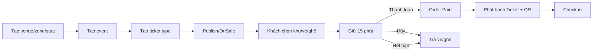

## 3. Đăng ký và xác thực email

### Endpoint chính

- `POST /api/auth/register`
- `POST /api/auth/verify-otp`
- `POST /api/auth/resend-otp`

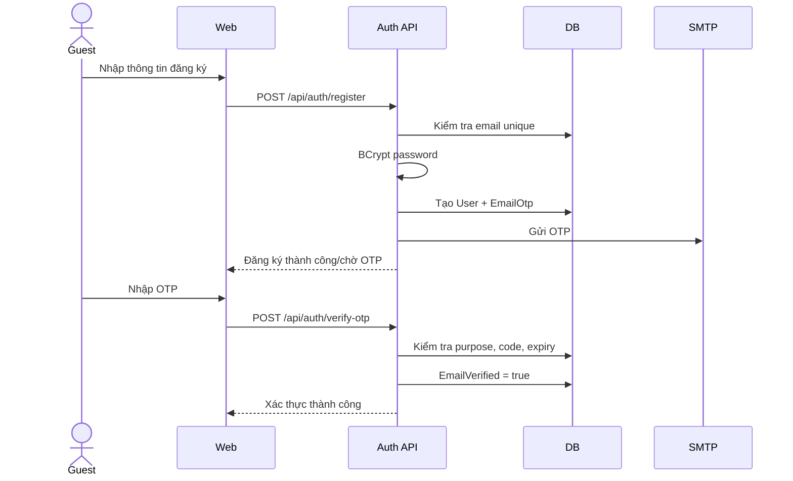

### Nhánh lỗi

- Email đã tồn tại → từ chối đăng ký.
- OTP sai/hết hạn → không xác thực.
- Resend tạo/gửi OTP mới theo rule AuthService.
- SMTP lỗi được xử lý theo hành vi AuthService; khác email booking vốn là best-effort.

## 4. Đăng nhập và refresh token

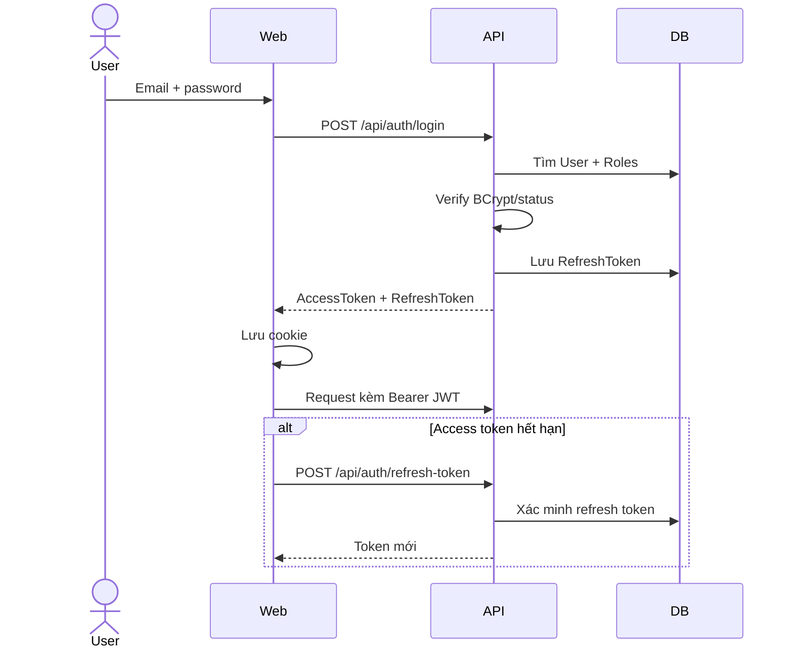

JWT được kiểm tra issuer, audience, signing key, lifetime và không có clock skew.

## 5. Đăng ký và duyệt Organizer

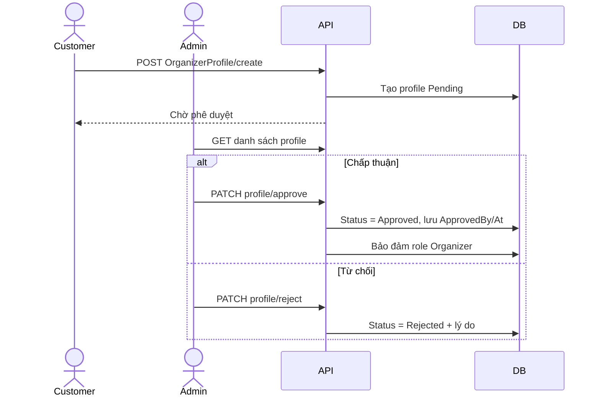

## 6. Tạo venue và ghế

### 6.1 Venue

1. Organizer tạo Venue.
2. Venue là địa điểm vật lý, không bắt buộc phải cấu hình VenueZone trước khi tạo event.

### 6.2 Ghế được generate từ TicketType

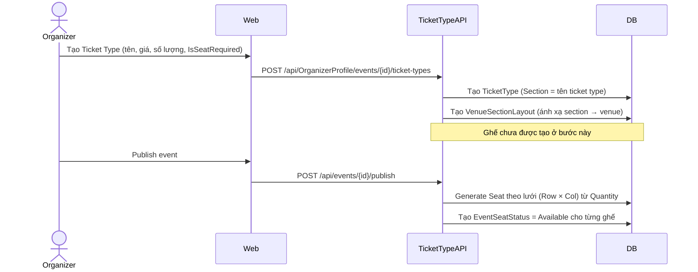

- Tên section của ghế lấy từ **tên TicketType** (không phải VenueZone).
- Ghế được đặt tên tự động: `{RowLabel}{Number}`, tọa độ tính theo lưới.
- `IsSeatRequired = true`: ghế ngồi, buyer chọn ghế cụ thể trên seat map.
- `IsSeatRequired = false`: vé đứng, buyer chỉ nhập số lượng.
- Ghế đã tạo ở lần publish trước sẽ được **skip** để tránh trùng.
- `VenueZoneId = null` trong luồng này; VenueZone là module tùy chọn riêng.

## 7. Sequence Diagram – quản lý tạo sự kiện mới

```mermaid
sequenceDiagram
    autonumber
    actor Organizer
    participant Web as Eventix.Web / EventWizard
    participant Session as Session Wizard
    participant File as File Storage
    participant VenueAPI as Venue API
    participant EventAPI as Events API
    participant TicketAPI as TicketType API
    participant SeatAPI as Seat / SeatMap API
    participant DB as SQL Server

    Organizer->>Web: Mở chức năng Tạo sự kiện
    Web->>EventAPI: GET danh mục sự kiện
    EventAPI->>DB: Đọc Categories
    DB-->>EventAPI: Danh sách danh mục
    EventAPI-->>Web: Categories
    Web-->>Organizer: Bước 1 - Thông tin sự kiện

    opt Organizer tải banner hoặc ảnh đại diện
        Organizer->>Web: Chọn file ảnh
        Web->>File: Lưu file vào uploads/events
        File-->>Web: Relative image URL
    end

    Organizer->>Web: Gửi thông tin, thời gian, ảnh
    Web->>Web: Validate dữ liệu Bước 1
    alt Thông tin không hợp lệ
        Web-->>Organizer: Hiển thị lỗi tại trường dữ liệu
    else Thông tin hợp lệ
        Web->>Session: Lưu EventWizard_Info
        Web-->>Organizer: Chuyển sang Bước 2
    end

    Web->>VenueAPI: GET danh sách địa điểm
    VenueAPI->>DB: Đọc Venues
    DB-->>VenueAPI: Danh sách địa điểm
    VenueAPI-->>Web: Venue list
    Web-->>Organizer: Bước 2 - Chọn hoặc tạo địa điểm

    alt Chọn địa điểm đã có
        Organizer->>Web: Chọn Venue
    else Tạo địa điểm mới
        Organizer->>Web: Nhập thông tin Venue
        Web->>VenueAPI: POST /api/Venue/create
        VenueAPI->>DB: INSERT Venue
        DB-->>VenueAPI: Venue đã tạo
        VenueAPI-->>Web: VenueId
    end
    Web->>Session: Lưu EventWizard_VenueId

    Web-->>Organizer: Bước 3 - Khai báo loại vé
    loop Mỗi khu / loại vé
        Organizer->>Web: Nhập tên khu, giá, số lượng,<br/>thời gian bán, vé đứng/ngồi
        Web->>Web: Validate Quantity, Price, SaleTime
        Web->>Session: Cập nhật EventWizard_TicketTypes
    end

    Web-->>Organizer: Bước 4 - Xem trước ghế ngồi
    Web->>SeatAPI: GET trạng thái ghế theo event/venue
    SeatAPI->>DB: Đọc cấu hình ghế hiện có
    DB-->>SeatAPI: Seat configuration
    SeatAPI-->>Web: Dữ liệu xem trước

    Web-->>Organizer: Bước 5 - Sắp xếp sơ đồ địa điểm
    Organizer->>Web: Di chuyển / thay đổi kích thước các khu
    Organizer->>Web: Nhấn Lưu sơ đồ
    Web->>SeatAPI: PUT /api/Venue/{venueId}/seat-map
    SeatAPI->>DB: Lưu VenueSectionLayouts
    DB-->>SeatAPI: Thành công
    SeatAPI-->>Web: Layout đã lưu
    Web->>Session: EventWizard_SeatMapSaved = true

    Web-->>Organizer: Bước 6 - Xem lại và công bố
    Organizer->>Web: Nhấn Công bố sự kiện
    Web->>Session: Đọc Info, VenueId, TicketTypes,<br/>SeatMapSaved, EventId nếu retry
    Web->>Web: Validate toàn bộ Wizard

    alt Wizard thiếu hoặc dữ liệu không hợp lệ
        Web-->>Organizer: Dừng publish và hiển thị lỗi
    else Dữ liệu hợp lệ
        alt Đã có EventWizard_EventId do lần publish trước gián đoạn
            Web->>Web: Tái sử dụng Draft EventId
        else Chưa có Draft Event
            Web->>EventAPI: POST /api/Events/create
            EventAPI->>DB: BEGIN TRANSACTION SERIALIZABLE
            EventAPI->>DB: Kiểm tra trùng Venue và thời gian
            alt Trùng lịch với sự kiện khác
                DB-->>EventAPI: Có khoảng thời gian giao nhau
                EventAPI->>DB: ROLLBACK
                EventAPI-->>Web: EVENT_EXIST
                Web-->>Organizer: Thông báo thời gian đã có sự kiện
            else Không trùng lịch
                EventAPI->>DB: INSERT Event trạng thái Draft
                EventAPI->>DB: COMMIT
                EventAPI-->>Web: Draft EventId
                Web->>Session: Lưu EventWizard_EventId
            end
        end

        opt Có Draft EventId hợp lệ
            Web->>TicketAPI: GET ticket types của Event
            TicketAPI->>DB: Đọc TicketTypes đã tạo
            DB-->>TicketAPI: Existing ticket types
            TicketAPI-->>Web: Danh sách hiện có

            loop Mỗi TicketType trong Session
                alt TicketType đã tồn tại và đúng Quantity
                    Web->>Web: Bỏ qua để tránh tạo trùng
                else TicketType chưa tồn tại
                    Web->>TicketAPI: POST /api/TicketType/event/{eventId}
                    TicketAPI->>DB: INSERT TicketType
                    DB-->>TicketAPI: TicketType đã tạo
                    TicketAPI-->>Web: Thành công
                end
            end

            alt Tạo TicketType thất bại
                Web->>EventAPI: DELETE Draft Event
                EventAPI->>DB: Xóa dữ liệu Draft có thể hoàn tác
                Web-->>Organizer: Báo lỗi và giữ dữ liệu Wizard để sửa
            else Tất cả TicketType hợp lệ
                Web->>EventAPI: POST /api/Events/{eventId}/publish
                EventAPI->>DB: Đọc Event, Venue và TicketTypes
                EventAPI->>EventAPI: Validate quyền sở hữu, quota,<br/>capacity và thời gian bán

                loop Mỗi TicketType có IsSeatRequired = true
                    EventAPI->>DB: Kiểm tra EventSeatStatus đã tồn tại
                    alt Chưa tạo ghế cho khu này
                        EventAPI->>DB: Generate Seats theo Quantity
                        EventAPI->>DB: INSERT EventSeatStatus = Available
                    else Ghế đã tồn tại
                        EventAPI->>EventAPI: Bỏ qua để tránh sinh trùng
                    end
                    EventAPI->>DB: Gắn TicketTypeId vào SectionLayout
                end

                EventAPI->>DB: Cập nhật trạng thái Published / OnSale
                DB-->>EventAPI: Publish thành công
                EventAPI-->>Web: Event đã công bố
                Web->>Session: Xóa dữ liệu EventWizard
                Web-->>Organizer: Chuyển tới Quản lý sự kiện
            end
        end
    end
```

### Ý nghĩa các nhánh quan trọng

- Dữ liệu từ Bước 1–5 được giữ trong `Session`; Event chưa được tạo trong database cho tới lúc nhấn
  **Công bố sự kiện**.
- Kiểm tra trùng địa điểm và thời gian được thực hiện trong transaction `Serializable`. Nếu trùng lịch,
  transaction rollback và không được tạo thêm Event.
- `EventWizard_EventId` giúp lần thử lại sử dụng đúng Draft đã tạo trước đó, không tạo sự kiện trùng.
- TicketType đã tồn tại với đúng số lượng sẽ được bỏ qua khi retry; TicketType còn thiếu mới được tạo tiếp.
- Ghế chỉ được sinh cho TicketType có `IsSeatRequired = true`. Vé đứng giữ nguyên `Quantity` nhưng không
  tạo danh sách ghế cụ thể.
- Nếu tạo TicketType thất bại, hệ thống xóa Draft vừa tạo và trả người dùng về bước xem lại để sửa dữ liệu.
- Sau khi publish thành công, Session Wizard được xóa và Organizer được chuyển đến trang quản lý sự kiện.

## 8. Publish và tự động cập nhật trạng thái Event

`EventStatusJob` chạy mỗi phút.

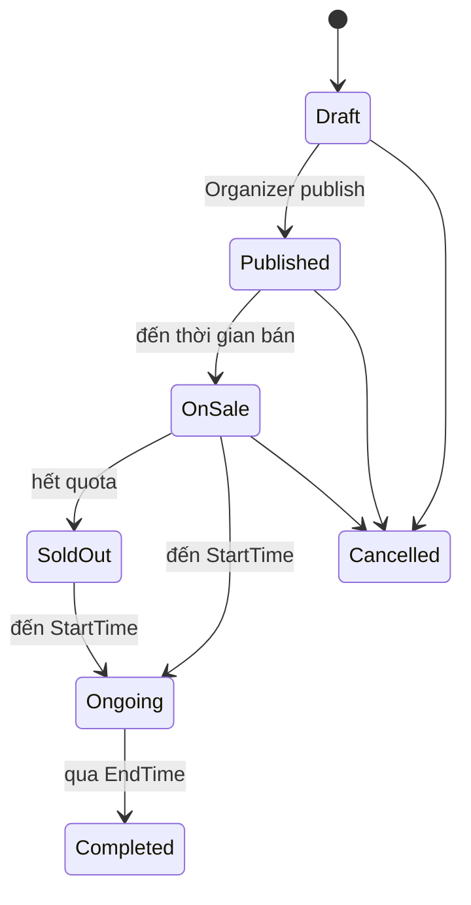

Job không được ghi đè `Cancelled`. Mọi thay đổi được lưu theo batch của lần chạy.

## 9. Sequence Diagram – Khách hàng đặt vé

```mermaid
sequenceDiagram
    autonumber
    actor Customer as Khách hàng
    participant Browser as Trình duyệt
    participant Web as Eventix.Web
    participant EventAPI as Events API
    participant BookingAPI as Booking API
    participant OrderAPI as Orders API
    participant PaymentAPI as Payment API
    participant DB as SQL Server
    participant QR as QR Generator
    participant Mail as Email Service
    participant Quartz as BookingExpirationJob

    Customer->>Browser: Mở chi tiết sự kiện
    Browser->>Web: GET /Event/Details/{eventId}
    Web->>EventAPI: GET /api/Events/{eventId}
    EventAPI->>DB: Đọc Event, Venue, TicketTypes và sơ đồ
    DB-->>EventAPI: Thông tin sự kiện
    EventAPI-->>Web: EventDetailResponse
    Web-->>Browser: Hiển thị sự kiện và nút Đặt vé

    Customer->>Browser: Chọn Đặt vé
    Browser->>Web: GET /Event/Booking/{eventId}
    Web->>EventAPI: GET /api/Events/{eventId}/booking
    EventAPI->>DB: Đọc TicketTypes và EventSeatStatus
    DB-->>EventAPI: Khu vé, quota và trạng thái ghế
    EventAPI-->>Web: EventBookingResponse
    Web-->>Browser: Hiển thị loại vé và sơ đồ khu

    Customer->>Browser: Chọn vé đứng hoặc vé ngồi
    Customer->>Browser: Chọn khu vé

    alt Vé đứng
        Customer->>Browser: Nhập số lượng vé
        Browser->>Browser: Không hiển thị sơ đồ ghế
    else Vé ngồi
        Browser->>Browser: Chỉ hiển thị ghế thuộc khu đã chọn
        Customer->>Browser: Chọn các ghế Available
        Browser->>Browser: Quantity = số SeatIds đã chọn
    end

    Customer->>Browser: Xác nhận đặt vé
    Browser->>Web: POST /Event/Book
    Web->>BookingAPI: POST /api/bookings<br/>EventId, TicketTypeId, Quantity, SeatIds
    BookingAPI->>DB: BEGIN TRANSACTION SERIALIZABLE
    BookingAPI->>DB: Đọc Event và TicketType
    BookingAPI->>BookingAPI: Kiểm tra event, thời gian bán,<br/>quota và quyền người dùng

    alt Dữ liệu chung không hợp lệ
        BookingAPI->>DB: ROLLBACK
        BookingAPI-->>Web: BadRequest / Conflict
        Web-->>Browser: Hiển thị lỗi đặt vé
    else Vé đứng hợp lệ
        BookingAPI->>DB: Kiểm tra AvailableQuantity >= Quantity
        alt Không đủ vé
            BookingAPI->>DB: ROLLBACK
            BookingAPI-->>Web: Không đủ số lượng vé
            Web-->>Browser: Yêu cầu chọn lại số lượng
        else Còn đủ vé
            BookingAPI->>DB: INSERT Reservation Active<br/>ExpiresAt = now + 15 phút
            BookingAPI->>DB: ReservedQuantity += Quantity
            BookingAPI->>DB: COMMIT
            BookingAPI->>Mail: Gửi email giữ vé thành công
            BookingAPI-->>Web: BookingResponse
        end
    else Vé ngồi hợp lệ
        BookingAPI->>BookingAPI: Loại bỏ SeatIds trùng<br/>và kiểm tra count = Quantity
        BookingAPI->>DB: Khóa và đọc EventSeatStatus
        alt Có ghế không còn Available
            BookingAPI->>DB: ROLLBACK
            BookingAPI-->>Web: 409 Seat not available
            Web-->>Browser: Tải lại sơ đồ và báo ghế đã được đặt
        else Tất cả ghế còn trống
            loop Mỗi ghế được chọn
                BookingAPI->>DB: INSERT một Reservation Active
                BookingAPI->>DB: SeatStatus = Reserved
            end
            BookingAPI->>DB: ReservedQuantity += số ghế
            BookingAPI->>DB: COMMIT
            BookingAPI->>Mail: Gửi email giữ vé thành công
            BookingAPI-->>Web: Danh sách BookingResponse
        end
    end

    Web-->>Browser: Trang xác nhận giữ vé<br/>và thời hạn thanh toán

    alt Khách hàng thanh toán trong 15 phút
        Customer->>Browser: Tiếp tục thanh toán
        Browser->>Web: Tạo đơn từ ReservationIds
        Web->>OrderAPI: POST /api/orders
        OrderAPI->>DB: BEGIN TRANSACTION SERIALIZABLE
        OrderAPI->>DB: Kiểm tra reservation thuộc khách,<br/>Active và chưa hết hạn
        OrderAPI->>OrderAPI: Tính Subtotal, ServiceFee và Total
        OrderAPI->>DB: INSERT Order Pending và OrderItems
        OrderAPI->>DB: Gắn Reservation.OrderId
        OrderAPI->>DB: COMMIT
        OrderAPI-->>Web: OrderResponse
        Web-->>Browser: Hiển thị trang thanh toán

        Customer->>Browser: Xác nhận thanh toán Demo
        Browser->>Web: POST hoàn tất thanh toán
        Web->>PaymentAPI: POST /api/payments/demo/complete
        PaymentAPI->>DB: BEGIN TRANSACTION SERIALIZABLE
        PaymentAPI->>DB: Đọc Order, Items và Reservations
        PaymentAPI->>PaymentAPI: Kiểm tra Pending và chưa hết hạn

        alt Order không còn hợp lệ
            PaymentAPI->>DB: ROLLBACK
            PaymentAPI-->>Web: Thanh toán thất bại
            Web-->>Browser: Hiển thị lý do thất bại
        else Order hợp lệ
            loop Mỗi reservation
                PaymentAPI->>DB: ReservedQuantity giảm<br/>SoldQuantity tăng
                PaymentAPI->>DB: Reservation = Confirmed
                opt Vé ngồi
                    PaymentAPI->>DB: SeatStatus = Sold
                end
                PaymentAPI->>DB: INSERT Ticket Active,<br/>TicketCode và QrToken
            end
            PaymentAPI->>DB: Order = Paid
            PaymentAPI->>DB: INSERT Payment Success
            PaymentAPI->>DB: COMMIT
            PaymentAPI->>QR: Sinh ảnh QR từ QrToken
            QR-->>PaymentAPI: Ảnh QR của từng vé
            PaymentAPI->>Mail: Gửi email đặt vé thành công kèm QR
            PaymentAPI-->>Web: PaymentResponse
            Web-->>Browser: Hiển thị thanh toán thành công
            Browser-->>Customer: Vé xuất hiện trong Vé của tôi
        end

    else Khách hàng chủ động hủy lượt giữ
        Customer->>Browser: Chọn Hủy vé đang giữ
        Browser->>Web: DELETE booking
        Web->>BookingAPI: DELETE /api/bookings/{reservationId}
        BookingAPI->>DB: Reservation = Cancelled
        BookingAPI->>DB: Hoàn ReservedQuantity và giải phóng ghế
        BookingAPI->>DB: Order Pending = Cancelled nếu có
        BookingAPI->>DB: COMMIT
        BookingAPI->>Mail: Gửi email hủy vé
        BookingAPI-->>Web: Hủy thành công
        Web-->>Browser: Cập nhật danh sách vé đang giữ

    else Không thanh toán trong 15 phút
        Quartz->>DB: Tìm Reservation Active đã hết hạn
        Quartz->>DB: Reservation = Expired
        Quartz->>DB: Order Pending = Expired nếu có
        Quartz->>DB: Hoàn ReservedQuantity và giải phóng ghế
        Quartz->>DB: COMMIT
        Quartz->>Mail: Gửi email đặt vé thất bại
        Mail-->>Customer: Thông báo vé đã hết thời gian giữ
    end
```

### Dữ liệu trả về khi mở trang đặt vé

Endpoint `GET /api/events/{eventId}/booking` trả về:

- Event, venue và thời gian diễn ra.
- TicketType của từng khu, loại vé đứng/ngồi, giá và số lượng còn lại.
- Ghế theo đúng `TicketTypeId`, section, row, number và trạng thái.
- Ghế `Reserved` hoặc `Sold` vẫn được trả về để giữ bố cục sơ đồ nhưng bị vô hiệu hóa.

### Điểm kiểm soát quan trọng

- Server luôn kiểm tra lại quota và trạng thái ghế trong transaction `Serializable`; giao diện không phải
  nguồn xác nhận cuối cùng.
- Khi đổi từ khu C1 sang C2/C3, giao diện chỉ hiển thị ghế có `TicketTypeId` của khu đang chọn và xóa
  các ghế đã chọn ở khu trước.
- Vé đứng tạo một reservation theo số lượng; vé ngồi tạo một reservation cho từng ghế.
- Email giữ vé chỉ gửi sau khi transaction giữ vé đã commit.
- Vé QR chỉ được phát hành sau khi thanh toán commit thành công.
- Nếu không thanh toán, Quartz giải phóng quota/ghế sau khoảng 15–16 phút và gửi email thất bại.

## 10. Giữ vé đứng

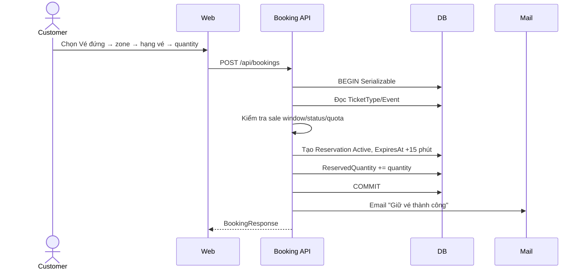

Vé đứng không nhận SeatIds. Nếu client gửi ghế cho ticket type không yêu cầu ghế,
API từ chối.

## 11. Giữ vé ngồi và chống trùng ghế

```mermaid
sequenceDiagram
    actor Customer
    participant Web
    participant API as Booking API
    participant DB

    Customer->>Web: Chọn Vé ngồi → zone → ticket type
    Web->>API: GET event booking/seat map
    Customer->>Web: Chọn các ghế Available
    Web->>API: POST /api/bookings với SeatIds
    API->>DB: BEGIN Serializable
    API->>API: Distinct SeatIds; count = Quantity
    API->>DB: Lấy EventSeatStatus Available
    alt Tất cả ghế còn trống
        API->>DB: Tạo một Reservation/ghế
        API->>DB: SeatStatus → Reserved
        API->>DB: ReservedQuantity += số ghế
        API->>DB: COMMIT
        API-->>Web: Danh sách reservation
    else Một ghế không còn Available
        API->>DB: ROLLBACK
        API-->>Web: 409 Seat not available
    end
```

Server là nguồn sự thật. Việc ghế hiển thị Available ở trình duyệt không bảo đảm ghế
còn trống tại thời điểm submit.

## 12. Tạo order

### Endpoint

`POST /api/orders`

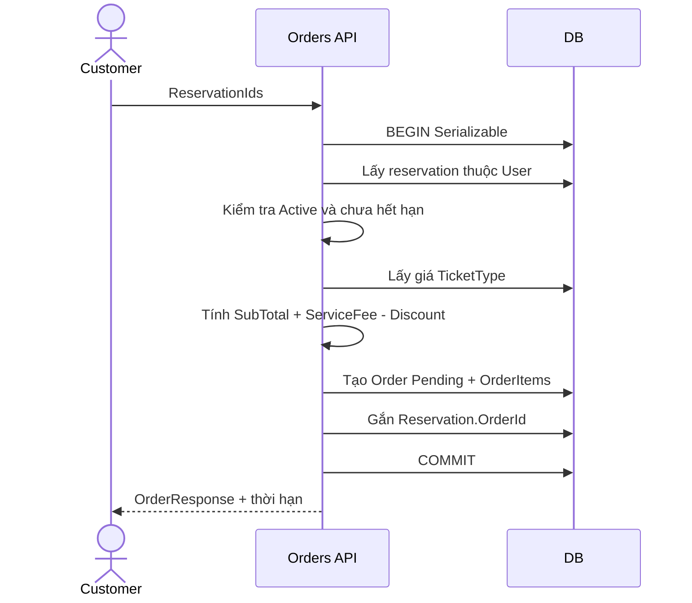

Nếu toàn bộ reservation đã thuộc cùng một order, service trả lại order đó thay vì tạo
trùng. Reservation thuộc order khác bị từ chối.

## 13. Thanh toán và phát hành vé QR

### Endpoint Demo

`POST /api/payments/demo/complete`

```mermaid
sequenceDiagram
    actor Customer
    participant API as Payment API
    participant DB
    participant QR as QRCoder
    participant Mail

    Customer->>API: OrderId
    API->>DB: BEGIN Serializable
    API->>DB: Lấy Order + Items + Reservations
    API->>API: Kiểm tra Pending, chưa hết hạn
    loop Mỗi reservation
        API->>DB: ReservedQuantity giảm; SoldQuantity tăng
        API->>DB: Reservation → Confirmed
        API->>DB: Ghế → Sold (nếu có)
        API->>DB: Tạo Ticket Active + TicketCode + QrToken
    end
    API->>DB: Order → Paid; tạo Payment Success
    API->>DB: COMMIT
    API->>QR: Tạo PNG từ từng QrToken
    API->>Mail: Email "Đặt vé thành công" + QR inline
    API-->>Customer: PaymentResponse
```

### Idempotency hiện tại

Nếu Order đã Paid, API tìm Payment Success và trả lại response, không phát hành vé
lần nữa. Email chỉ được gửi ở nhánh thanh toán mới thành công.

### QR

- `QrToken` là payload được mã hóa thành QR.
- TicketCode và QrToken đều unique.
- Email dùng QRCoder tạo PNG và MimeKit gắn `Content-ID` cho từng ảnh.

## 14. Hủy lượt giữ

### Endpoint

`DELETE /api/bookings/{reservationId}`

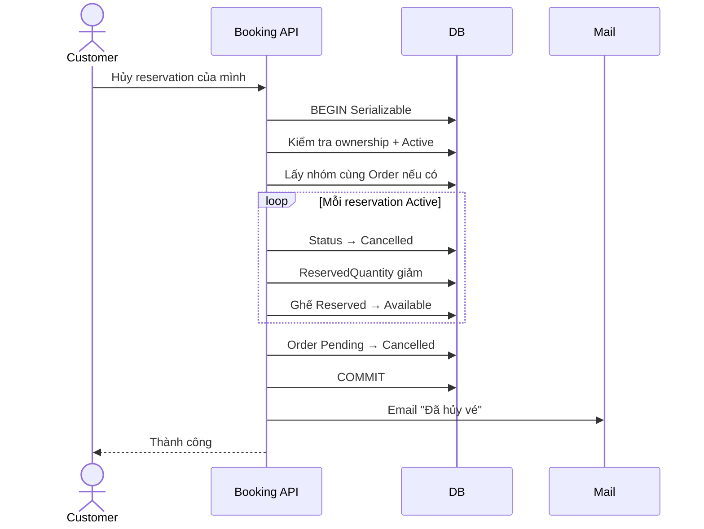

Reservation Confirmed/Expired/Cancelled không thể hủy bằng luồng giữ vé này.

## 15. Tự động hết hạn sau 15 phút

`BookingExpirationJob` chạy mỗi phút và có `DisallowConcurrentExecution`.

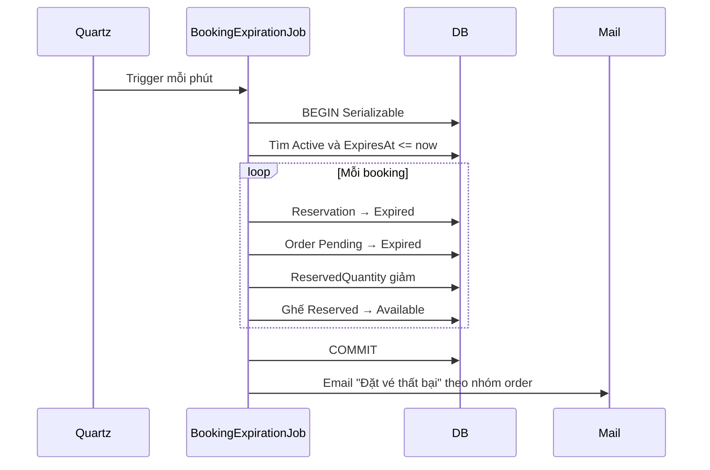

Do chu kỳ một phút, email có thể đến ở phút 15–16. Nhiều reservation cùng order được
gộp thành một email.

## 16. Vòng đời email booking

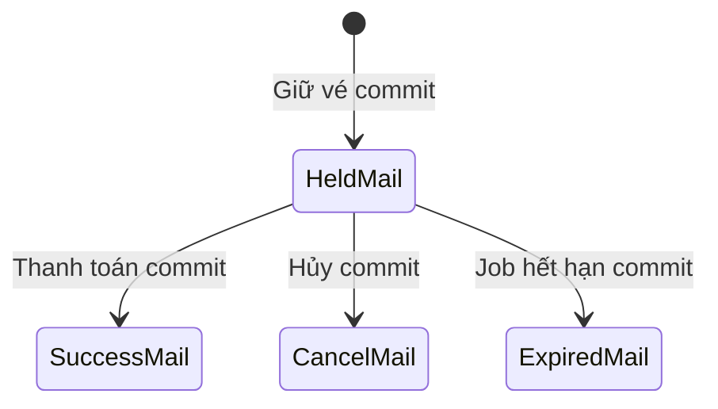

| Mốc | Subject | Nội dung chính |
|---|---|---|
| Giữ | Giữ vé thành công | Hạng vé/ghế/tổng tiền/hạn 15 phút |
| Thanh toán | Đặt vé thành công | Order, ticket code, QR inline |
| Hủy | Đã hủy vé | Vé/ghế đã trả hệ thống |
| Hết hạn | Đặt vé thất bại | Lý do quá hạn và hướng dẫn đặt lại |

SMTP exception được catch và log. Trạng thái DB đã commit không bị rollback.

## 17. Xem vé điện tử

- `GET /api/tickets/my`: danh sách vé của user.
- `GET /api/tickets/{id}`: chi tiết vé thuộc user.
- `GET /api/tickets/event/{eventId}`: danh sách vé sự kiện cho Organizer/Admin.

Razor View dùng qrcode.js để dựng QR trên trang chi tiết; email dùng QRCoder phía API.
Cả hai cùng mã hóa đúng `QrToken`.

## 18. Check-in

### Endpoint

- Nhập token: `POST /api/checkin/scan` với JSON.
- Tải ảnh: `POST /api/checkin/scan-image` với multipart, tối đa 5 MB.

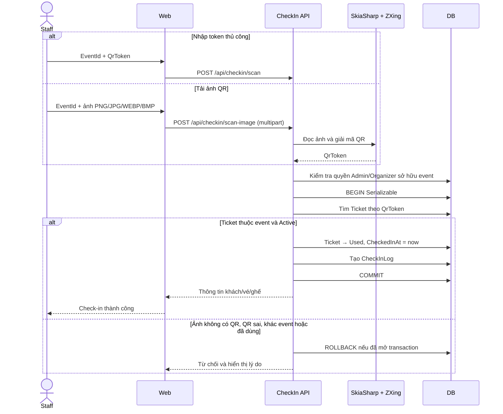

Hai cách nhập chỉ khác bước lấy `QrToken`; authorization, ownership, kiểm tra trạng
thái vé và chống check-in hai lần dùng chung `CommerceService.CheckInAsync`.

Thống kê `GET /api/checkin/event/{eventId}/stats` trả tổng ticket không Cancelled,
số Used và số còn lại.
## 19. Luồng lỗi và response

API sử dụng response chuẩn:

```text
ApiResponseModel<T>
├── IsSuccess / Code / Message
└── Data
```

- Validation/business rule → 400.
- Không tìm thấy → 404.
- Tranh chấp ghế → 409.
- Chưa đăng nhập/token hết hạn → 401.
- Thiếu quyền/không sở hữu → 403.
- Lỗi không xử lý → middleware trả response lỗi chuẩn và log.

Trong transaction, exception dẫn tới rollback. Riêng lỗi email xảy ra sau commit và
bị catch để không đổi kết quả nghiệp vụ.

## 20. Các luồng dự kiến chưa triển khai

Những luồng sau chưa có implementation:

- Payment gateway thật (VNPay, MoMo), callback/webhook và reconciliation.
- AI tagging và recommendation.

## 21. Checklist kiểm thử luồng

### Booking

- Hai user chọn cùng ghế gần đồng thời: chỉ một người thành công.
- Chọn ghế Sold/Reserved: 409 và không tăng counter.
- Vé đứng quantity vượt quota: bị từ chối.
- Hủy nhóm nhiều ghế: trả đủ counter và ghế.

### Payment

- Order hết hạn không thanh toán được.
- Gọi thanh toán hai lần không tạo ticket trùng.
- Nhiều ghế tạo đúng số ticket và QR.

### Expiration

- Sau 15–16 phút reservation/order thành Expired.
- Ghế trở lại Available và có thể đặt lại.
- Một email thất bại cho mỗi order.

### Check-in

- QR đúng/event đúng/ticket Active: thành công.
- Quét lại QR: thất bại.
- Organizer khác event: 403.

### Email

- Mail giữ, thành công, hủy, hết hạn đến đúng tài khoản.
- Gmail/Outlook hiển thị QR inline.
- SMTP lỗi không làm API báo thất bại sau khi transaction đã commit.